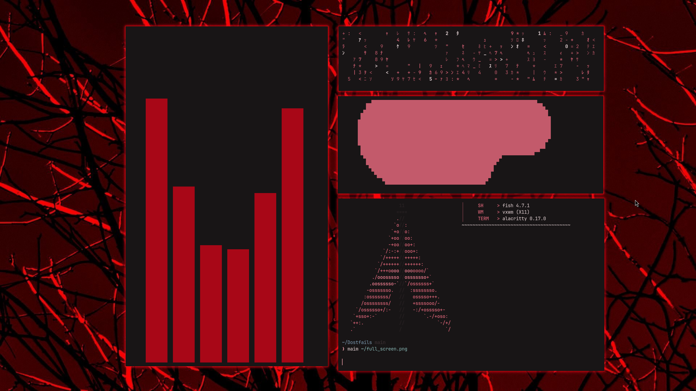

# CachyOS Custom Build (X11 & Wayland)

Описание кастомной сборки операционной системы на базе CachyOS с поддержкой графических сред X11 и Wayland.

## Необходимые пакеты

### PACMAN
```text
accountsservice  
alsa-firmware  
alsa-plugins  
alsa-utils  
awesome-terminal-fonts  
base  
bluez-hid2hci  
bluez-obex  
bluez-utils  
btrfs-assistant  
cachyos-fish-config  
cachyos-grub-theme  
cachyos-hello  
cachyos-hooks  
cachyos-kernel-manager  
cachyos-keyring  
cachyos-micro-settings  
cachyos-mirrorlist  
cachyos-niri-noctalia  
cachyos-packageinstaller  
cachyos-plymouth-bootanimation  
cachyos-plymouth-theme  
cachyos-rate-mirrors  
cachyos-settings  
cachyos-v3-mirrorlist  
cachyos-v4-mirrorlist  
cachyos-wallpapers  
cachyos-zsh-config  
caelestia-meta  
cantarell-fonts  
cava  
cpupower  
dmraid  
dolphin  
duf  
efitools  
ethtool  
ffmpegthumbnailer  
firefox-i18n-ru  
fsarchiver  
glances  
google-chrome  
grub-btrfs-support  
grub-hook  
gst-libav  
gst-plugins-bad  
gst-plugins-ugly  
hdparm  
hwdetect  
hwinfo  
hyprlock  
inetutils  
intel-ucode  
jfsutils  
kitty  
lavat-git  
lib32-vulkan-icd-loader  
libva-nvidia-driver  
linux-cachyos-headers  
linux-cachyos-lts-headers  
logrotate  
lsb-release  
lsscsi  
ly  
man-pages  
meld  
nano-syntax-highlighting  
netctl  
networkmanager-openvpn  
nfs-utils  
nvidia-580xx-dkms  
onefetch  
paru  
pavucontrol  
picom  
polkit-kde-agent  
pv  
rebuild-detector  
reflector  
sddm  
sg3_utils  
shelly  
sof-firmware  
swaykbdd  
ttf-opensans  
ufw-extras  
unimatrix-git  
unrar  
unzip  
vesktop  
vlc-plugins-all  
waypaper  
xl2tpd  
xorg-xinit  
yay  
ytm-player  
```

### YAY
```text
app2unit  
caelestia-cli  
caelestia-meta  
caelestia-shell  
lavat-git  
libcava  
noctalia-qs-git  
python-materialyoucolor  
qtengine  
swaykbdd  
ttf-rubik-vf  
unimatrix-git  
ytm-player  
```

---

## Горячие клавиши (Keybinds)

Все конфигурационные файлы и бинды копируются в домашнюю директорию (`~`).

* **Mod + d** — fuzzel-rofi  
* **Mod + t** — alacritty  
* **Mod + w** — kill active  
* **Mod + space** — float-tile  

---

## Системные команды для настройки (System commands)

Выполните в терминале для переключения дисплейного менеджера на `ly` и сборки оконного менеджера `vxwm`:

```bash
# Отключение SDDM и включение Ly TDM
sudo systemctl disable sddm  
sudo systemctl enable ly  

# Сборка и установка vxwm
cd ~/vxwm && sudo make clean install  
sudo rvx  
```

> **Примечание для пользователей из РФ:** Утилиты обхода блокировок типа Zapret могут работать нестабильно или не работать вовсе из-за особенностей фильтрации ТСПУ. Рекомендуется использовать альтернативные методы (например, настроенный AmneziaWG или актуальные конфигурации ByeDPI).
